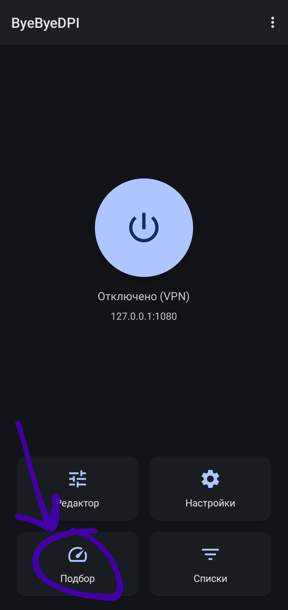
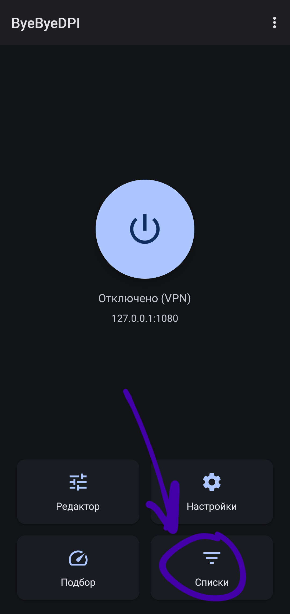
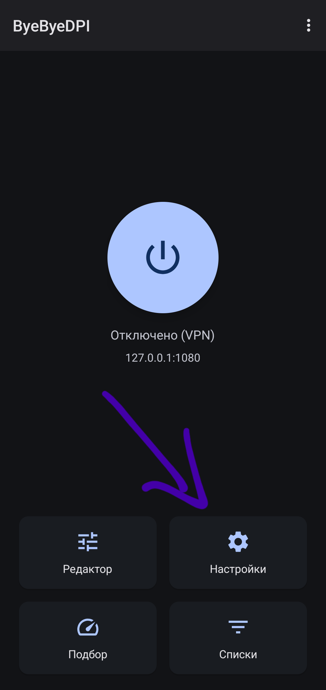
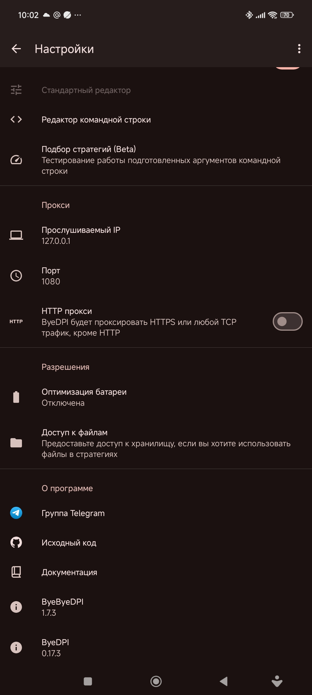
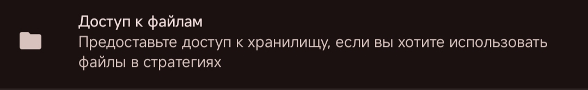
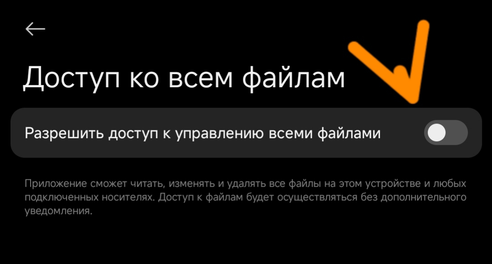

1. [Белый и чёрный списки](#whitelist-blacklist)
2. [Редактор командной строки](#editor)
3. [Свой список команд (стратегий)](#my-list)
4. [Списки доменов для подбора](#domain-list)
5. [Разблокировать свои ресурсы](#my-services)
6. [Экспорт и импорт настроек](#export-import)
7. [Способы запуска](#launch)
8. [Режимы VPN и Proxy](#vpn-proxy)
    - [Режим HTTP-proxy](#http-proxy)
9. [Точечная маршрутизация сайтов (доменов)](#split-tunneling)
10. [Раздача интернета с ByeByeDPI](#distribute)
11. [Автоматизация](#automation)
    - [Автоматическая смена стратегии при отключении/подключении Wi-Fi](#automatic-switching)
    - [Автозапуск ByeByeDPI при запуске YouTube](#youtube-autostart)
14. [Настройки для работы с AdGuard](#adguard)
15. [Автообновление](#autoupdate)
16. [Работа с файлами](#work-with-files)

## <a id="whitelist-blacklist">Белый и чёрный списки</a>

_Белый_ список - выбранные приложения **будут работать** через ByeByeDPI, все остальные будут работать в обход ByeByeDPI.
**Черный** список - выбранные приложения **НЕ будут работать** через ByeByeDPI, все остальные будут работать через ByeByeDPI.

> [!TIP]
> Почему списки **важны**? Некоторые приложения (например, Телеграм) могут не работать или работать некорректно.
> Плюсом ко всему, чем **меньше трафика** проходит через ByeByeDPI, тем **меньше** заряда батареи **тратится**.
> На некоторых телевизорах (приставках) без настройки белого списка может **совсем не работать интернет**.

## <a id="editor">Редактор командной строки</a>


В разделе **Редактор командной строки** находится список **Аргументов командной строки** (стратегий), которые применялись ранее.


> [!WARNING]
> Будьте внимательны: длина списка ограничена, если список переполнится - самые старые стратегии пропадут

Над списком есть строка `Список стратегий`, которая позволяет управлять историей стратегий. При нажатии на строку появляется меню с двумя опциями:

- `Удалить незакреплённые` - удаляет все стратегии, которые не закреплены.

- `Очистить историю` - удаляет абсолютно все стратегии из истории.
> [!CAUTION]
> Эти действия **необратимы**!

Если **нажать** на стратегию - появится меню:


- Действие **Применить** - применит команду (сделает её текущим _Аргументом командной строки_)

  - 

- Действие **Закрепить** - закрепит стратегию сверху списка

  - 

- Действие **Переименовать** - позволяет дать имя стратегии или переименовать её

  - 

- Действие **Редактировать** - редактирует стратегию на месте (без необходимости сохранять её как другую).    
- Действие **Копировать** - скопирует стратегию в буфер обмена
- Действие **Удалить** - удалит стратегию из списка (истории)

Под активной стратегией есть 2 кнопки - `Очистить` и `Вставить`. 

При нажатии на кнопку `Очистить` - поле для ввода очистится, никакой стратегии не будет применено.

При нажатии на кнопку `Вставить` - в поле вставится содержимое буфера обмена.

## <a id="my-list">Свой список команд (стратегий)</a>

> [!IMPORTANT]
> Использовать свой список стратегий нужно **только в случае**, если в результате автоподбора небольшой процент ответа от доменов. Если вы видите, что у стратегий одинаковый (невысокий) процент ответа - решение [тут](problems.md#у-команд-стратегий-одинаковый-невысокий-процент)

Результаты автоподбора вас не устроили.
Вы где-то нашли команды (стратегии), но проверять каждую вручную очень глупое и утомительное занятие.

В таком случае: 
- Перейдите в пункт **«Подбор команд (Beta)»**[^1]

    - 

- Перейдите в **настройки Подбора** (шестерёнка справа сверху)

  - 

- Активируйте переключатель **Свой список стратегий**

  - 

- Нажмите на пункт **Список стратегий**

- Откроется окно

  - 

- В данное окно необходимо ввести свой список стратегий

> [!IMPORTANT]
> Каждая новая стратегия должна быть на **новой строке**. Команды (стратегии) **нельзя** разделять какими-либо символами (запятые, точки и т.д.) - стратегии разделяются **новой строкой**

- После ввода стратегий, нажмите **OK**

  - 

- Вернитесь в пункт **Подбор стратегий (Beta)** и нажмите на кнопку «Начать проверку». После этого начнётся проверка стратегий, которые вы вставили в список

- Дождитесь окончания проверки и действуйте дальше как при [стандартной настройке](start.md#настройка). Если подбор вылетает - решение [здесь](problems.md#вылетает-подбор).

## <a id="domain-list">Списки доменов для подбора</a>

Перейдите в раздел меню: **Списки**.



В приложение вшиты несколько списков доменов для подбора стратегий.


На данный момент в приложении реализованы несколько списков *(нажмите на каждый, чтобы открыть и посмотреть)*:
<details>
<summary>Cloudflare</summary>

```
cloudflare.net
cloudflare.com
cloudflarecn.net
cloudflare-ech.com
```

</details>
<details>
<summary>Discord</summary>

```
dis.gd
discord.co
discord.gg
discord.app
discord.com
discord.dev
discord.new
discord.gift
discord.gifts
discord.media
discord.store
discord.design
discordapp.com
discordcdn.com
discordsez.com
discordsays.com
discordmerch.com
discordpartygames.com
discordactivities.com
stable.dl2.discordapp.net
discord-attachments-uploads-prd.storage.googleapis.com
```

</details>

<details>
<summary>General</summary>

```
rutracker.org
nyaa.si
rutor.org
nnmclub.to
speedtest.net
ookla.com
```

</details>

<details>
<summary>Googlevideo</summary>

```
rr1---sn-4axm-n8vs.googlevideo.com
rr1---sn-gvnuxaxjvh-o8ge.googlevideo.com
rr1---sn-ug5onuxaxjvh-p3ul.googlevideo.com
rr1---sn-ug5onuxaxjvh-n8v6.googlevideo.com
rr4---sn-q4flrnsl.googlevideo.com
rr10---sn-gvnuxaxjvh-304z.googlevideo.com
rr14---sn-n8v7kn7r.googlevideo.com
rr16---sn-axq7sn76.googlevideo.com
rr1---sn-8ph2xajvh-5xge.googlevideo.com
rr1---sn-gvnuxaxjvh-5gie.googlevideo.com
rr12---sn-gvnuxaxjvh-bvwz.googlevideo.com
rr5---sn-n8v7knez.googlevideo.com
rr1---sn-u5uuxaxjvhg0-ocje.googlevideo.com
rr2---sn-q4fl6ndl.googlevideo.com
rr5---sn-gvnuxaxjvh-n8vk.googlevideo.com
rr4---sn-jvhnu5g-c35d.googlevideo.com
rr1---sn-q4fl6n6y.googlevideo.com
rr2---sn-hgn7ynek.googlevideo.com
rr1---sn-xguxaxjvh-gufl.googlevideo.com
```

</details>

<details>
<summary>Social</summary>

```
snapchat.com
snap.com
linkedin.com
facebook.com
fb.com
fb.me
fbcdn.net
messenger.com
meta.com
instagram.com
static.cdninstagram.com
proton.me
medium.com
x.com
twitter.com
soundcloud.com
telegram.org
whatsapp.com
```

</details>

<details>
<summary>Youtube</summary>

```
youtu.be
youtube.com
i.ytimg.com
i9.ytimg.com
yt3.ggpht.com
yt4.ggpht.com
googleapis.com
jnn-pa.googleapis.com
googleusercontent.com
signaler-pa.youtube.com
youtubei.googleapis.com
manifest.googlevideo.com
yt3.googleusercontent.com
```

</details>

Каждый отдельный список можно добавить в проверку стратегий, отметив его (квадратик справа от списка). 
При нажатии на список открывается меню:


- **Редактировать** - редактировать список (добавить/убрать домены). Не рекомендуется делать с встроенными списками.
- **Копировать** - скопировать список в буфер обмена.
- **Удалить** - удалить список. **КРАЙНЕ** не рекомендуется делать с встроенными доменами.

Также к этим спискам можно добавить пользовательские. Для этого нажмите на строку сверху "Добавить список". Появится меню:


В строку `Название списка` введите название вашего списка.

В строку `Домены, каждый с новой строки` введите домены необходимого сервиса, каждый с новой строки.

После этого сохраните пользовательский список кнопкой ОК.

> [!TIP]
> Помните, крупные сайты и ресурсы для своей корректной работы могут требовать достаточно большое количество доменов.

Домены для различных сервисов можно найти [здесь](https://www.netify.ai/resources/applications), в этом [репозитории](https://github.com/v2fly/domain-list-community) или на этом [сайте](https://iplist.opencck.org/).

Если вы хотите сами выяснить какие домены используются: в этой [статье](https://itdog.info/analiziruem-trafik-i-opredelyaem-domeny-kotorye-ispolzuyut-sajty-i-prilozheniya/) подробно рассказывается про сниффинг трафика на различных устройствах и системах.

## <a id="my-services">Разблокировать свои ресурсы</a>

Как уже было сказано, по умолчанию подбор стратегий проверяет стратегии на доменах ютуб и гуглвидео. Это можно изменить, чтобы проверять стратегии под ваши ресурсы:

- Перейдите в **настройки подбора**.

    - 
    
    - 
    
- Выберите необходимые списки. При необходимости добавьте пользовательские, как описано [тут](#domain-list).

- После этого ищите стратегию [аналогичным образом](start.md#setting), которым искали стратегию для YouTube.

> [!WARNING]
> Если у всех стратегий 0% - скорее всего ресурс заблокирован по IP и ByeByeDPI здесь ничем не сможет помочь.

## <a id="export-import">Экспорт и импорт настроек</a>

Чтобы экспортировать или импортировать настройки, зайдите в **_основные настройки ByeByeDPI_** (шестерёнка справа внизу):



- Нажмите на три точки в верхнем правом углу

  - 

> [!WARNING]
> С версии 1.4.2 используется другой формат файла. Настройки с более старых версий не получится импортировать.

- Выберите экспорт/импорт в зависимости от того что вам нужно (экспорт или импорт). Все настройки экспортируются в файл в формате `json`. При импорте необходимо указать данный файл.

  - 

## <a id="launch">Способы запуска</a>

### Классический запуск

Есть классический способ запуска: при помощи нажатия кнопки **Подключить**

- 

> [!TIP]
> Кому-то это может показаться неудобным, поэтому есть другие варианты.

### Запуск через шторку

- Зайдите в свою шторку и найдите пункт **Изменить** (или что-то вроде)

  - 
    

- После этого вы увидите неактивные элементы. Найдите среди них ByeByeDPI, зажмите и перетащите его к основным элементам.

  - 

- Не забудьте сохранить изменения

  - 

- Теперь вы можете запускать ByeByeDPI нажатием кнопки в шторке

  - 

### Контекстное меню

Если зажать иконку ByeByeDPI появится контекстное меню через которое можно быстро включить и выключить приложение.


Также через контекстное меню можно запускать закреплённые стратегии. Они будут иметь имена, если вы дали им название (в примере выше закреплённая стратегия `main`). 
### Виджет

Приложение не реализует функционал виджета по умолчанию. Несмотря на это, создать виджет возможно:

Некоторые лаунчеры позволяют сделать виджет из пунктов контекстного меню


Также если у вас есть закреплённые стратегии в командной строке, виджет можно сделать и из них, зажав пункт в контекстном меню и перетащив на главный экран. 

Если ваш лаунчер не имеет такого функционала, воспользуйтесь приложением `QuickShortcutMaker`.

## <a id="vpn-proxy">Режимы VPN и Proxy</a>

> [!CAUTION]
> Использовать режим **Proxy** можно только в том случае, если вы подключаетесь при помощи прокси-клиента.

> [!WARNING]
> Известен только один клиент YouTube с встроенным прокси-клиентом: SmartTube. Если он не работает у вас в связке с ByeByeDPI (например, из-за Android 9) и вы по какой-то причине не можете или не хотите использовать ByeByeDPI в режиме VPN - смотрите YouTube через Firefox с настроенным расширением ZeroOmega (подробнее про это [здесь](#extension)).

> [!TIP]
> Для чего использовать режим прокси? Данный режим полезен, если вы хотите параллельно использовать приложения, работающие в режиме VPN (например, AdGuard и др.) или если вы целенаправленно хотите использовать какой-либо прокси-клиент (например, расширение ZeroOmega для точечного проксирования сайтов в браузере)

Режим VPN **насильно** пропускает трафик через ByeDPI. Режим Proxy просто поднимает локальный **SOCKS-прокси**.

Локальный прокси поднимается и в режиме VPN: можно подключаться к прокси при помощи какого-либо прокси-клиента при использовании ByeByeDPI в режиме _белого_ списка.

Прокси поднимается в любом режиме, но в режиме VPN клиентом данного прокси является ByeByeDPI
Схематическое изображение работы VPN-режима (HevSocks5Tunnel и ByeByeDPI направляют трафик в интернет):


В режиме Proxy пользователю нужно самому подключить прокси-клиент к прокси для выхода в интернет:


### <a id="http-proxy">Режим HTTP-proxy</a>

В данном режиме будет проксироваться HTTPS или любой TCP трафик, кроме HTTP.

По умолчанию ByeByeDPI запускает локальный SOCKS-прокси, но некоторые прокси-клиенты не способны работать с таким протоколом. В таком случае можно активировать **режим HTTP-прокси**.
Чтобы сделать это, необходимо активировать переключатель HTTP-прокси:


> [!NOTE]
> Другой вариант активации данного режима - приписать к стратегии аргументы: `-G` или `--http-connect` (данные аргументы идентичны по смыслу).
>
> Пример такой стратегии:
> `--http-connect -d1 -s0+s -d3+s -s6+s -d9+s -s12+s -d15+s -s20+s -d25+s -s30+s -d35+s -At,r,s -s1 -o1+s -s-1`

## <a id="split-tunneling">Точечная маршрутизация сайтов (доменов)</a>

> [!NOTE]
> Подробнее про объединение стратегий и точечную маршрутизацию при помощи ByeDPI читайте в этом [обсуждении](https://github.com/BDManual/ByeByeDPI-Manual/discussions/36).

> [!TIP]
> Для чего нужная точечная маршрутизация? Обход DPI может ломать сайты, которые работают без всяких обходов. Например, `kremlin.ru`

### Нативный способ

Чтобы ByeByeDPI обрабатывал только определённые домены, можно добавить в стратегию аргумент `--hosts` (`-H`) и вписать нужные домены:

```
# из документации к ByeDPI

-H, --hosts <file|:string>
    Ограничить область действия параметров списком доменов
    Домены должны быть разделены новой строкой или пробелом

```

### "Белый список" для доменов

Если указать хостлист до завершения группы (_-A_), то стратегия для этой группы будет взаимодействовать только с доменами из списка.

Примером такой стратегии будет:

```
-H:"googlevideo.com youtubei.googleapis.com i.ytimg.com yt3.ggpht.com youtube.com" -o1+s -d3+s -a2
```

> [!NOTE]
> Скобки необходимы из-за особенностей механизма парсинга

> [!TIP]
> Использовать белый список в таком режиме не обязательно

### "Чёрный список" для доменов

В некоторых случаях требуется ограничить работу ByeByeDPI на каких-то конкретных доменах: например, для `kremlin.ru` и `ya.ru`. Чтобы ByeByeDPI не обрабатывал трафик, с этих доменов необходимо в начале стратегии добавить список доменов в отдельную группу: `-H:"kremlin.ru ya.ru" -An`. Если говорить простыми словами, данная часть означает: если домен `kremlin.ru` или `ya.ru` - ничего не делай. **Важно** не забыть _-A_ с нужным параметром после списка.

Пример такой стратегии будет выглядеть следующим образом:

```
-H:"kremlin.ru ya.ru" -An -o1+s -d3+s -a2
```

---

> [!TIP]
> В стратегии можно указать путь, по которому находится текстовый файл с доменами. Для этого необходимо дать ByeByeDPI разрешение на доступ к файлам.
> Таким же образом можно указать содержимое фейковых пакетов.

Пример такой стратегии:
`-Ku -a10 -An -Kt,h -H /storage/emulated/0/Documents/domain.txt -s1 -q1 -Art -f-1 --md5sig -r1+s -An`

Важно помнить, что после флага `-An` все фильтры сбрасываются, то есть если вы хотите сохранить некий фильтр (по портам, например) и в следующей группе, его нужно прописать заново.

Справедливо и обратное: Если вы применили фильтр по доменам к группе, уже ограниченной фильтром (допустим, по протоколам), и хотите чтобы следующая группа, ограниченная по другим протоколам тоже имела фильтр на домены - его нужно прописать заново.

Например, частая ошибка такова:
```
-Ku -H:"googlevideo.com" -a3 -An -Kt,h -s1 -d3 -s10

```

В таком случае ограничение по домену имеет только `-a3`, следующая группа будет работать по всем доменам.

### <a id="extension">Расширение для браузера</a>

Другим вариантом может точечной маршрутизации будет использование прокси-расширения для браузера. В примере будет рассматриваться браузер `Firefox` с установленным расширением `ZeroOmega--Proxy SwitchyOmega V3`, но вы можете выбрать любое другое подобное расширение и любой другой браузер с поддержкой расширений.

- Первым делом активируем в ByeByeDPI режим прокси или **убираем из белого списка браузер**, в который будем устанавливать расширение
- Устанавливаем расширение и не забываем дать разрешение на работу в приватных окнах (это необходимо для работы прокси). Нажимаем кнопку **Добавить**

  - 

- После этого откроем список расширений и нажмём на `ZeroOmega`

  - 

- Перейдём во вкладку настроек

  - 

- Во вкладке _Proxy_ настроим подключение: протокол (по умолчанию у ByeByeDPI SOCKS5), адрес и порт прокси (адрес и порт указаны в настройках ByeByeDPI). В моём случае:

```
Protocol: SOCKS5
Server: 127.0.0.1
Port: 1080
```

- После настройки подключения не забываем применить изменения: нажать `Applay changes`

  - 

- Перейдём во вкладку `auto switch`. И добавим _Switch rules_. Например, я добавил:

```
Condition Type: Host Wildcard
Condition Details: *.youtube.com
Profile: proxy
```

- Не забываем сохранить изменения: нажимаем `Applay changes`

  - 

- После этого пробуем зайти на нужный ресурс. Он **может не открыться** сразу. Необходимо изменить режим `ZeroOmega` на режим `auto switch`.

  - 

  - 

- После этого нужно обновить страницу с вашим ресурсом. Или перейти по нужной ссылке: например, я открыл видео для просмотра. Но оно не начало воспроизводиться. Значит необходимо перейти в настройки расширения:

  - 

- В режиме `auto switch` расширение сообщит, если какие-то домены не могут нормально работать:

  - 

- Открываем вкладку _failed resources_, меняем их профиль на proxy и добавляем:

  - 

- Обновляем страницу: теперь всё работает

  - 

- В настройках это теперь выглядит как-то так:

  - 

> [!IMPORTANT]
> При отключенном ByeByeDPI домены, которые указаны для проксирования, не будут работать совсем. При отключении ByeByeDPI рекомендуется сменить режим `ZeroOmega` на _Direct_

## <a id="distribute">Раздача интернета с ByeByeDPI (локальный прокси)</a>

Допустим у вас есть **iPhone** *(или другое устройство, на которое можно установить прокси-клиент)* и телефон с Android 6.0+ *(или другое устройство, на котором работает ByeByeDPI)*.
На телефон установлен ByeByeDPI, подобрана рабочая стратегия. На **iPhone** *(или другом устройстве)* ставится прокси-клиент с поддержкой **SOCKS5** (например `Happ` подойдёт для iOS и Android).

Чтобы раздать доступ к ByeByeDPI, нужно сделать так, чтобы оба устройства *(можно подключать не одно устройство, но в примере одно)* были в одной локальной сети. Можно их подключить к одной точке доступа, можно раздать точку доступа прямо с телефона, в целом это не имеет значения - главное, чтобы устройства находились в одной локальной сети.

Далее в настройках ByeByeDPI необходимо выставить адрес и порт на `0.0.0.0` и `1080` (порт можно любой незанятый) соответственно.

> [!CAUTION]
> Если вы хотите, чтобы на устройстве, с работающим ByeByeDPI, продолжал работать YouTube (и не только), то не активируйте режим Proxy. Иначе вам придётся ставить прокси-клиент и на устройство с ByeByeDPI. Чтобы понимать, почему так происходит, и почему вы сможете подключаться с другого устройства даже при работе ByeByeDPI в режиме VPN - читайте [здесь](#vpn-proxy).


Запускаем ByeByeDPI.

После этого необходимо определить ip устройства в локальной сети, на котором запущен ByeByeDPI. Для этого используйте приложение [Android Network Tools](https://github.com/stealthcopter/AndroidNetworkTools). При заходе в это приложение будет написан IP-адрес:


IP устройства также можно узнать в настройках сети или при помощи приложения [Ning](https://github.com/csicar/Ning).

> [!TIP]
> Для знающих: поставьте статический ip для телефона, если вы будете часто подключаться через него.

После этого открываем прокси-клиент на **iPhone** *(или другом устройстве)*. В примере используется `Happ`.

> [!WARNING]
> На iPhone нет туннелирования отдельных приложений. Вам придется добавлять собственные маршруты. В некоторых регионах, например в России, возможность подключения к SOCKS-прокси может быть удалена из Happ (в этом случае используйте другой клиент)

Добавляем подключение:


> [!IMPORTANT]
> Протокол SOCKS5 или SOCKS


Вводим ip устройства, на котором работает ByeByeDPI (ip выясняли при помощи *Android Network Tools*) и порт, который указан в ByeByeDPI. После ввода не забываем сохранить изменения.

> [!IMPORTANT]
> У прокси-сервера, который поднимает ByeByeDPI нет ни логина, ни пароля - в прокси-клиентах оставляем поля пустыми.


Если у прокси-клиента есть возможность проверки соединения, сделайте это


> [!NOTE]
> Если ответа нет, значит нет соединения: выключен ByeByeDPI, указаны неверные данные или устройства находятся в разных сетях.

После этого укажем приложения, с которыми должен работать ByeByeDPI на **iPhone** *(или другом устройстве)*:


После этого можно запускать приложение и смотреть YouTube


Прокси-клиенты на различные устройства и систем:

- на iPhone - `Happ`, `FoXray`, `Shadowrocket`, `Sockswitch-Shadowsocks Client`, `Potatso Lite`
- на Windows - можно использовать браузерные расширения, например, `ZeroOmega--Proxy SwitchyOmega V3` (алгоритм настройки [здесь](#extension) - единственное отличие: нужно вписывать не `127.0.0.1`, а ip устройства с запущенным ByeByeDPI) или использовать приложения: [nekoray](https://github.com/MatsuriDayo/nekoray/), proxifier, [proxifyre](https://github.com/wiresock/proxifyre), Happ, [sockscap64](https://www.sockscap64.com/homepage/) (для старых Windows).
- на MacBook - FoXray, [V2RayXS](https://github.com/tzmax/V2RayXS) (для старых маков), [nekoray](https://github.com/Mahdi-zarei/nekoray).
- на другое Android-устройство - `Happ`, [nekobox](https://github.com/MatsuriDayo/NekoBoxForAndroid), proxifier for Android, [SocksDroid](https://github.com/bndeff/socksdroid) (требуется Android 5.0+), [SocksTun](https://github.com/heiher/sockstun), для старых версий Андроид ProxyDroid (требуется рут).

## <a id="automation">Автоматизация</a>

По умолчанию `ToggleActivity` поддерживает подключение/отключение ByeByeDPI.

Если [закрепить](#editor) стратегии и дать закреплённым стратегиям [названия](#editor), то `ToggleActivity` будет поддерживать следующие параметры:

| Параметр      | Действие                                  | Тип    |
| ------------- | ----------------------------------------- | ------ |
| `strategy`    | Сменить стратегию и подключится           | String |
| `only_update` | Только обновить стратегию без подключения | Bool   |
| `only_start`  | Запустить сервис без смены стратегии      | Bool   |
| `only_stop`   | Остановить сервис без смены стратегии     | Bool   |

> [!TIP]
> Это может быть полезно для автоматической смены стратегии при подключении к другой сети: например, переключение с Wi-Fi на мобильный интернет или переключение от одного сотового оператора к другому. Сценарии реализуются при помощи специальных приложений, например, при помощи `MacroDroid`.

### <a id="automatic-switching">Автоматическая смена стратегии при отключении/подключении Wi-Fi</a>

Нередки случаи, когда при подключении к Wi-Fi нужна одна стратегия, а при использовании мобильного интернета требуется другая стратегия. Ниже представлен скрипт для MacroDroid, который будет менять закреплённые стратегии в зависимости от состояния подключения к Wi-Fi.

Чтобы воспользоваться скриптом, скачайте [файл](https://github.com/HideakiTaiki/ByeByeDPI-Manual/blob/main/automatic_switching.category) и импортируйте его в MacroDroid.

### <a id="youtube-autostart">Автозапуск ByeByeDPI при запуске YouTube</a>

Встроенной функции запуска ByeByeDPI при запуске каких-либо приложений нет и не планируется, однако данный функционал возможно реализовать при помощи приложения `MacroDroid`.

> [!WARNING]
> Необходимо снять ограничение на открытие приложений при работе фоном.

Активити запуска/остановки в ByeByeDPI - ToggleActivity.
Выглядеть должно примерно так:


Можно также сделать условие: если VPN включен и YouTube закрыт, тоже вызываем ToggleActivity


## <a id="adguard">Настройки для работы с AdGuard</a>

Переключаем ByeByeDPI в режим Proxy.


Добавьте ByeByeDPI в исключения AdGuard на вкладке "Управление приложениями":
в самом AdGuard переходим в центральную вкладку, а после ищем ByeByeDPI, и просто обрубаем его фильтрацию.


После переходим в настройки -> фильтрация -> сеть -> прокси. Его врубаем, а после вводим те же значения прокси, которые указаны у вас в ByeByeDPI, обязательно в режиме SOCKS5.


Ну и соответственно включаем работу прокси в AdGuard.

> [!WARNING]
> Если при проверке Adguard скажет "Не удалось подключиться к прокси", ничего страшного - прокси на самом деле работает!

> [!IMPORTANT]
> Может понадобиться добавить ByeByeDPI в исключения AdGuard другим способом:
> Заходим в AdGuard -> настройки -> основные-> расширенные->низкоуровневые настройки-> исключенные приложения.
> Добавить в список id приложения ByeByeDPI
> `io.github.romanvht.byedpi`


## <a id="autoupdate">Автообновление</a>

Приложение не реализует функционал автообновлений. Чтобы ByeByeDPI обновлялся автоматически, необходимо использовать [Obtainium](https://github.com/ImranR98/Obtainium).

- Установите Obtainium
- Нажмите на пункт "Добавить приложение"
	- 
- Добавьте репозиторий ByeByeDPI: `https://github.com/romanvht/ByeByeDPI/releases`
	- 
- Приложение добавлено
	- 
- Чтобы изменить параметры автообновления, необходимо изменить настройки Obtainium.


## <a id="work-with-files">Работа с файлами</a>

В стратегиях можно использовать файлы из Вашей файловой системы.

Чтобы этим воспользоваться:

- Откройте настройки ByeByeDPI
  - 
- Нажмите на "Работа с файлами"
  - 
- Активируйте тумблер
  - 
  
Теперь вы можете вставить в стратегию путь к файлу.

Если вы хотите использовать в стратегии, допустим, бинарные файлы, хотите сократить её от хостлистов или IP вы можете использовать эту функцию.

Пример указания пути: `-f1 -Qm=512 -l:/storage/emulated/0/downloads/g.bin`

Здесь указан путь к файлу `g.bin`, который находится в `downloads`

Работа с файлами также применима к аргументам поддерживающие file в значении. (Подробнее о них можно узнать в [документации ByeDPI](https://github.com/hufrea/byedpi)).


---

[^1]: Подбор команд находится в разработке. Могут быть ошибки. **Стратегии не генерируются автоматический** - они всегда одни и те же. В текущей реализации подбор по сути ничего не подбирает - он просто проверяет работу набора стратегий, которые были добавлены в него разработчиком.
